# WellCal — AI Calorie Tracker

> **Photograph your food. Get instant AI-powered nutritional breakdown.**

WellCal is a production-quality mobile app built with Expo / React Native that uses OpenAI Vision to identify food from photos and return accurate calorie and macro data — calories, protein, carbs, and fat. Features a daily diary, macro progress rings, weekly history charts, streak tracking, and a full AI scan log.

---

## Screenshots

| Diary — Calorie Ring | Diary — Macro Rings | Scan Tab | AI Food Scanner |
|:---:|:---:|:---:|:---:|
| 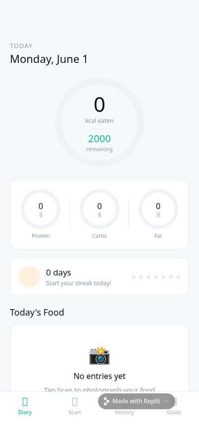 | 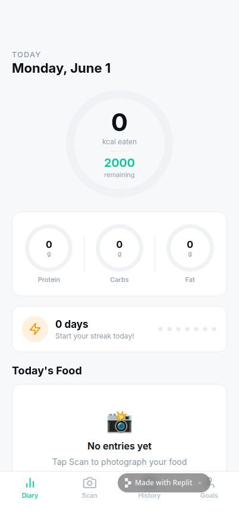 |  | 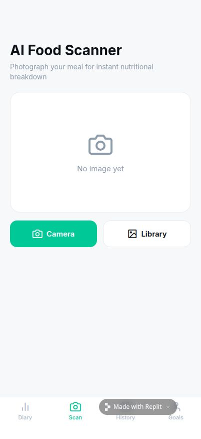 |

| History Tab | History — Weekly Chart | History — 7-Day Avg | Goals & Profile |
|:---:|:---:|:---:|:---:|
|  | 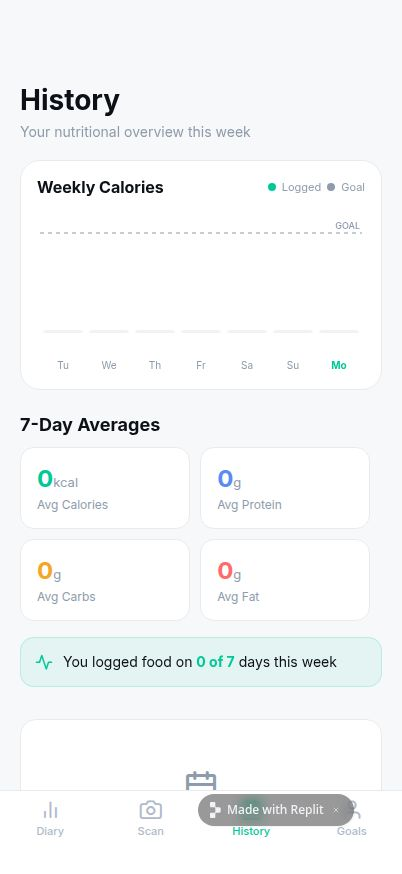 | 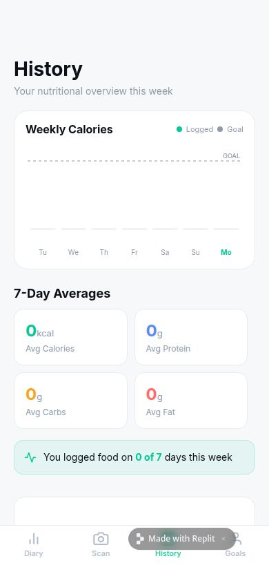 |  |

| Goals — Edit Targets | Goals — Save | Streak Tracker | Tab Navigation |
|:---:|:---:|:---:|:---:|
| 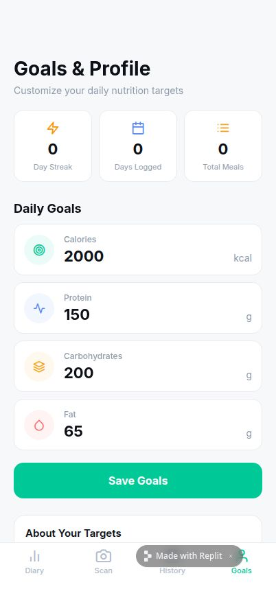 | 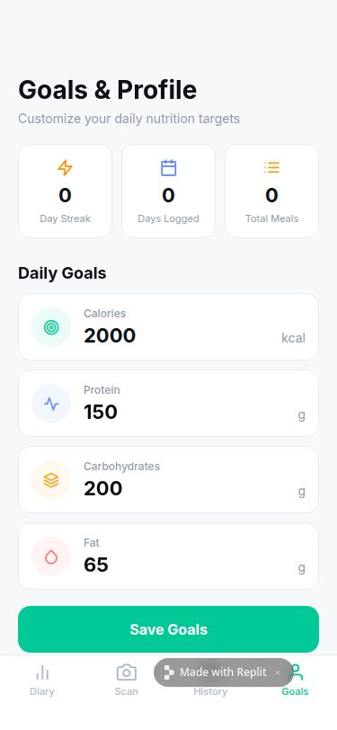 | 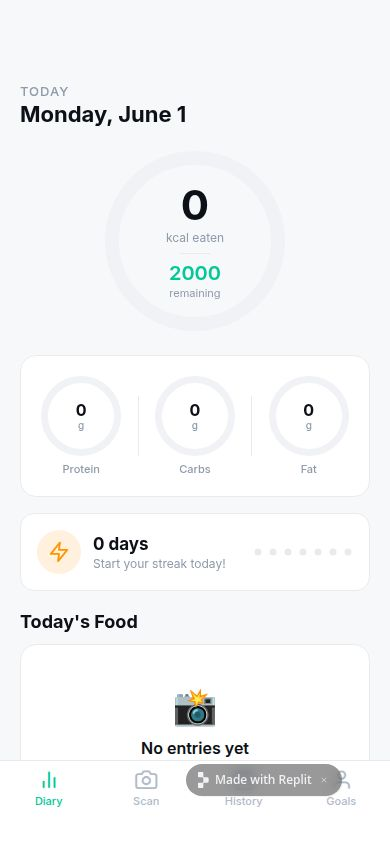 | 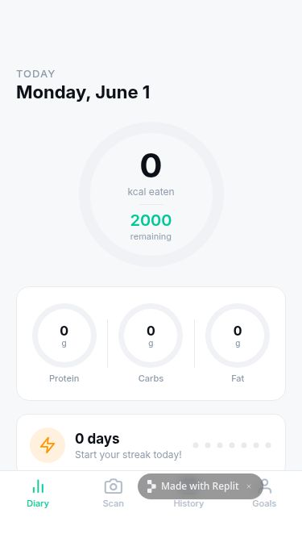 |

| Camera & Library | Scan Buttons | History Averages |
|:---:|:---:|:---:|
| 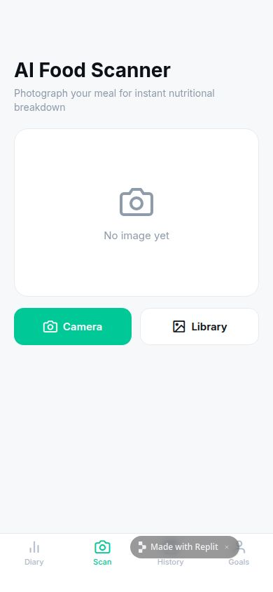 | 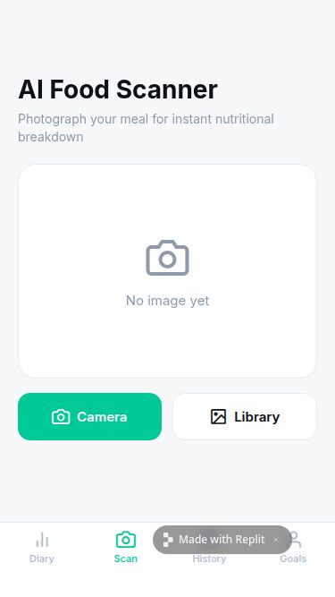 | 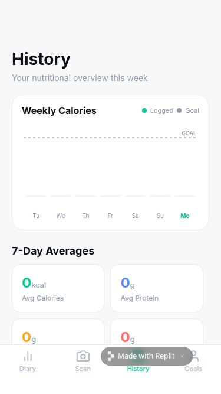 |

---

## Features

### 🤖 AI Food Recognition
- Photograph any meal or packaged food using your camera or photo library
- OpenAI Vision (`gpt-5.2`) analyzes the image on the server and returns:
  - Food name + estimated serving size
  - Calories, protein, carbs, fat
  - Confidence score (0–100%)
  - Ingredient list
  - Brief health insight
- All AI scans are timestamped, logged, and viewable in the **AI Logs** tab
- AI log stats: total scans, average confidence, average response time (ms), meals saved to diary

### 📓 Daily Food Diary
- Running calorie total vs. your daily goal
- Large animated calorie progress ring with remaining/over indicator
- Macro progress rings for protein, carbs, and fat
- Per-entry food cards: photo thumbnail, macros, time, swipe-to-delete
- All data persists locally via AsyncStorage — no account needed

### 🔥 Streak Tracking
- Counts consecutive days with at least one logged meal
- Visual dot indicator (7-dot row) for the current week
- Displayed on the diary screen

### 📊 Weekly History & Charts
- 7-day calorie bar chart with dashed goal line
- 7-day macro averages (calories, protein, carbs, fat)
- 30-day recent-days log with per-day calorie progress bars
- "Days logged this week" activity banner

### 🎯 Custom Daily Goals
- Edit calorie and macro targets (protein, carbs, fat)
- Saved instantly to device storage
- Lifetime stats: day streak, days logged, total meals scanned

### 📋 AI Scan Log
- Every AI food analysis is automatically recorded
- Stores: food name, macros, confidence score, model used, response time, whether added to diary, ingredient list, health notes
- Filterable stats panel at the top of the log
- Clear all logs with confirmation

---

## Tech Stack

| Layer | Technology |
|---|---|
| Mobile Framework | Expo SDK 54 / React Native 0.81 |
| Navigation | Expo Router (file-based, NativeTabs) |
| AI | OpenAI Vision via Replit AI Integrations (`gpt-5.2`) |
| State | React Context + AsyncStorage |
| Server | Express 5 + TypeScript |
| Charts | react-native-svg (custom SVG bar chart) |
| Icons | @expo/vector-icons (Feather) |
| Fonts | Inter (400/500/600/700) via @expo-google-fonts |
| Styling | React Native StyleSheet |

---

## Project Structure

```
WellCal-app/
├── app/
│   ├── _layout.tsx              # Root layout — providers, fonts, SplashScreen
│   └── (tabs)/
│       ├── _layout.tsx          # Tab bar (NativeTabs / Liquid Glass on iOS 26+)
│       ├── index.tsx            # Diary screen
│       ├── scan.tsx             # AI Food Scanner screen
│       ├── history.tsx          # History + AI Logs screen
│       └── profile.tsx          # Goals & Profile screen
├── components/
│   ├── CalorieRing.tsx          # Large animated calorie progress ring (SVG)
│   ├── MacroRing.tsx            # Small macro progress ring (SVG)
│   ├── FoodCard.tsx             # Food diary entry card
│   ├── WeeklyChart.tsx          # 7-day calorie bar chart (SVG)
│   ├── StreakCard.tsx           # Streak dot indicator card
│   └── ErrorBoundary.tsx        # App-level crash boundary
├── context/
│   └── NutritionContext.tsx     # Global state: diary, AI logs, goals, streak
├── constants/
│   └── colors.ts                # Light + dark theme palette
├── hooks/
│   └── useColors.ts             # Theme-aware color hook
├── assets/
│   └── images/
│       └── icon.png             # App icon (AI-generated)
├── screenshots/                 # App screenshots for this README
└── app.json                     # Expo config — permissions, plugins
```

### Backend (API Server — `artifacts/api-server`)

```
src/
├── routes/
│   ├── ai.ts                    # POST /api/ai/analyze-food — OpenAI Vision
│   └── health.ts                # GET /api/healthz
└── app.ts                       # Express app — 25MB body limit for image upload
```

---

## AI Logs — Full Detail

Every time a photo is analyzed by the AI, a structured log entry is saved automatically to AsyncStorage with this schema:

```typescript
interface AILog {
  id: string;             // Unique ID
  timestamp: number;      // Unix ms
  foodName: string;       // "Grilled Chicken Salad"
  calories: number;       // 420
  protein: number;        // 38
  carbs: number;          // 22
  fat: number;            // 14
  servingSize: string;    // "1 large bowl (~400g)"
  confidence: number;     // 0.0 – 1.0
  imageUri?: string;      // Local photo URI
  ingredients: string[];  // ["grilled chicken", "romaine", "cherry tomatoes", ...]
  healthNotes?: string;   // "High-protein, low-carb meal — excellent for muscle recovery."
  addedToDiary: boolean;  // Whether user tapped "Add to Diary"
  modelUsed: string;      // "gpt-5.2"
  responseTimeMs: number; // 847
}
```

Viewable in-app under **History → AI Logs** tab with aggregate stats.

---

## Getting Started

### Prerequisites
- Node.js 20+
- pnpm 9+
- Expo Go app (iOS or Android) for device testing

### Install

```bash
# Clone the repo
git clone https://github.com/your-username/wellcal.git
cd wellcal

# Install dependencies
pnpm install

# Set required environment variables
# Create a .env file:
# AI_INTEGRATIONS_OPENAI_BASE_URL=<your-openai-proxy-url>
# AI_INTEGRATIONS_OPENAI_API_KEY=<your-key>
# DATABASE_URL=<postgres-connection-string>
```

### Run

```bash
# Start the API server
pnpm --filter @workspace/api-server run dev

# Start the Expo app (in a new terminal)
pnpm --filter @workspace/wellcal run dev
```

Scan the QR code from the Expo CLI output with Expo Go on your phone.

---

## Environment Variables

| Variable | Description |
|---|---|
| `AI_INTEGRATIONS_OPENAI_BASE_URL` | OpenAI-compatible proxy base URL |
| `AI_INTEGRATIONS_OPENAI_API_KEY` | API key for the proxy |
| `DATABASE_URL` | PostgreSQL connection string |
| `EXPO_PUBLIC_DOMAIN` | Auto-injected in Replit — API domain for the Expo client |

---

## API Reference

### `POST /api/ai/analyze-food`

Analyzes a food image using OpenAI Vision and returns structured nutritional data.

**Request body:**
```json
{ "imageBase64": "<base64-encoded-jpeg>" }
```

**Response:**
```json
{
  "analysis": {
    "name": "Avocado Toast with Poached Egg",
    "calories": 380,
    "protein": 16,
    "carbs": 34,
    "fat": 22,
    "servingSize": "1 slice (~220g)",
    "confidence": 0.91,
    "ingredients": ["sourdough bread", "avocado", "poached egg", "chili flakes"],
    "healthNotes": "Rich in healthy fats and complete protein — a well-balanced breakfast."
  }
}
```

---

## Design Decisions

- **Frontend-only state**: All diary data, AI logs, and goals are stored in AsyncStorage — no account or server database required. The server is only used for the OpenAI API call.
- **SVG charts**: All rings and bar charts are built from scratch with `react-native-svg` for full control over animations and theming.
- **Dual tab display for AI logs**: AI scan history is a separate tab inside History rather than a standalone tab, to keep the bottom tab bar to 4 items.
- **25MB body limit on server**: Base64-encoded images can be 5–15MB; the Express body parser is configured accordingly.
- **Confidence scoring**: AI confidence is shown as a colored badge — green ≥80%, amber 60–79%, red <60% — so users can judge reliability at a glance.

---

## License

MIT — free to use, modify, and distribute.
